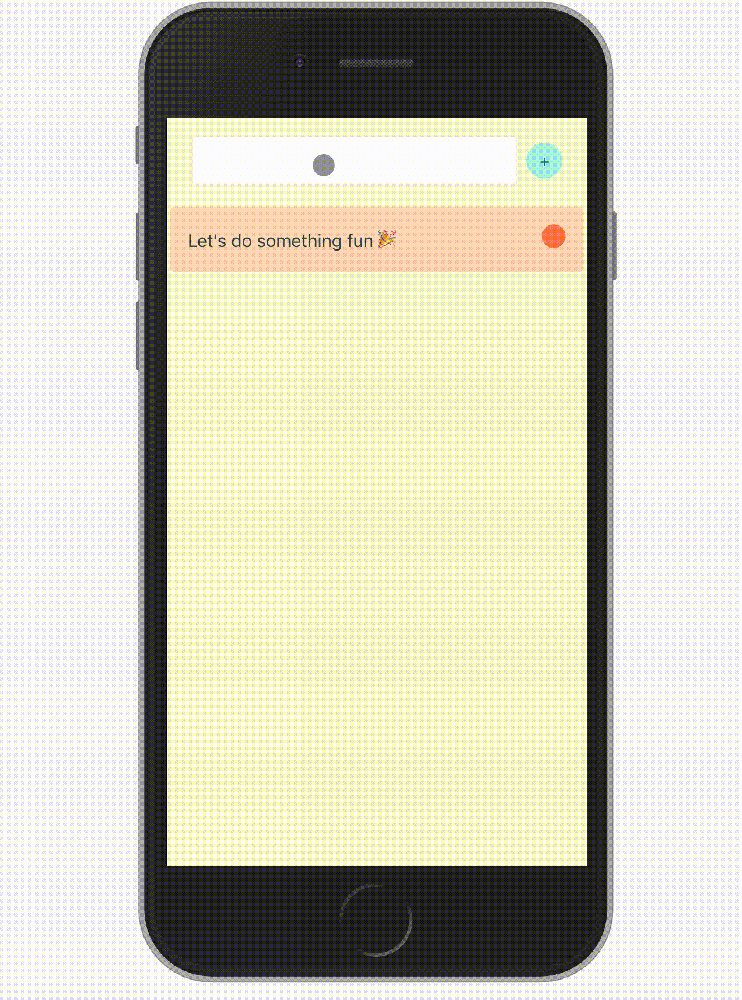

### a teeny tiny to do list just to try hooks <3

#### To run this repo:

1. clone the repo
   `git clone https://github.com/isnotafunction/hooks-todo.git`

2) install dependencies
   `npm i`

3) start by running:
   `npm start`

4) do something:
   
